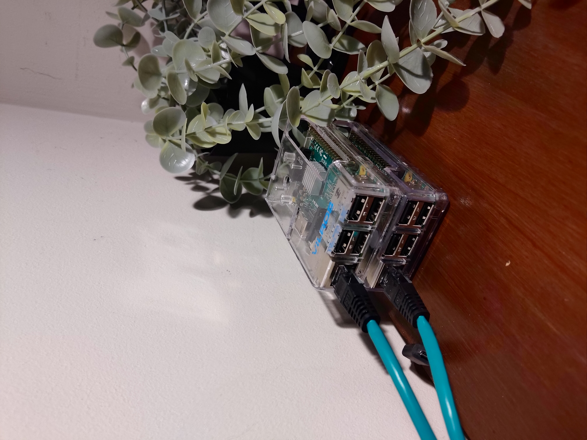

<h1>👋 Hi. Welcome to my Personal Portfolio</h1>

## About Me 📌

- 🍩 Computer science and pure mathematics student
- 🐍 Experience in Java development, Python & JS
- ☕ Work and projects can be found here ➡ [finnlestrange.tech/projects](https://finnlestrange.tech/projects)
- 📠 Blog posts & CTF write-ups ➡ [finnlestrange.tech/blog](/blog)
- 📚 IB Analysis & Approaches Mathematics notes / worked problems can be found by contacting me via my education email.
- 🎒 [The International School Aberdeen](https://github.com/InternationalSchoolAberdeen)

## 🧠 My Active Projects

- ☕ GitHub Resource of Advanced Data Structures and Algorithms in Java 16 - [Repository Here](https://github.com/71xn/algorithmsDataStructures)
- 🥧 Raspberry Pi B+ [k3s](https://k3s.io/) Cluster

## ✔ Previous Projects (2021)

- 🌍 [FuturistFest Hackathon](https://futuristfest.finnlestrange.tech) - Carbon Footprint Calculator written in `React` and `Python Flask`, submitted for an international hackathon

- 🌲 [#CSFORGOOD Air Pollution Visualization](https://csforgood.finnlestrange.tech/) - `React.js` based air pollution visualization app
